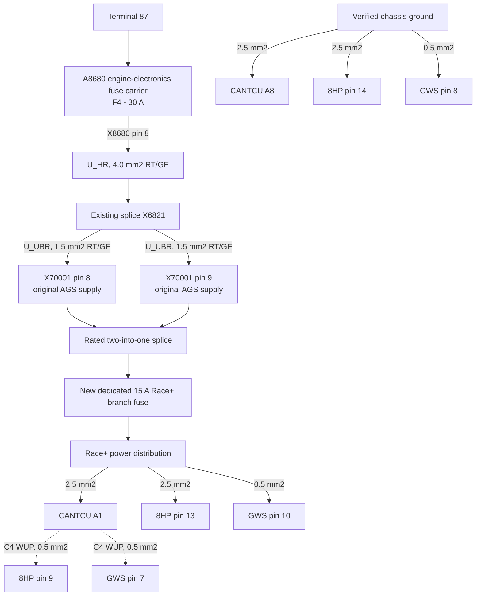

# CANTCU Installation

## Scope

This document covers installation and wiring of CANTCU hardware revision 1.9, serial number 468B, in the E38 740d. It includes power, grounds, transmission wiring, selector integration, CAN wiring, interlocks, reverse lights, and electrical validation.

Race+ is the selected software and installation baseline. CANformance identifies Race+ as the preferred solution for new supported 8HP installations and lists ZF 8HP70 as supported. The current [Race+ installation instructions](https://wiki.canformance.net/CANTCU/software/race-plus/installation) are controlling for transmission power, CAN, WUP, and diagnostics. Also use the official pages for the [Race+ overview](https://wiki.canformance.net/CANTCU/software/race-plus), exact [vehicle/ECU integration](https://wiki.canformance.net/CANTCU/integrations/supportedECUs), [shifter](https://wiki.canformance.net/CANTCU/integrations/supportedshifters), and [CANTCU pinout](https://wiki.canformance.net/CANTCU/hardware/CANTCU_pinout). If this guide conflicts with current CANformance documentation, follow CANformance and record the revision used.

Use only the wiring diagram for the exact controller hardware and firmware. Do not infer terminal assignments from another revision. Mechanical work is covered in [Hardware Installation](HW-Installation.md); software setup is covered in [CANTCU Programming and Calibration](CANTCU-Programming.md).

## Components and Tools

- CANTCU controller and compatible wiring harness
- BMW F-series 8HP GWS `61 31 9 296 898`, matching connector, donor loom, and mounting parts
- Brake-pedal signal and optional mode, manual-shift, or paddle switches
- A dedicated 15 A branch fuse and conductors rated for the calculated continuous current, inrush current, and installation temperature
- Laptop and CANformance 8HP TCM Tool for stock backup, Race+ programming, and diagnostics through CANTCU
- Automotive sealed connectors and suitable power cable
- Twisted-pair CAN wiring
- Crimping tools for the selected automotive terminals
- Digital multimeter and two-channel oscilloscope or CAN diagnostic interface
- BMW wiring diagrams and diagnostic equipment

## 1. Establish the Electrical Baseline

Before modifying the vehicle:

1. Scan all control modules and save the diagnostic report.
2. Verify operation of the engine, charging system, ABS wheel-speed signals, brake switch, instrument cluster, and existing vehicle buses.
3. Photograph wiring routes, connector locations, grounds, and the original selector mechanism.
4. Repair existing faults so they cannot be confused with conversion faults.

## 2. Plan the Installation

Select a dry controller location protected from heat, vibration, water, and physical damage. Plan serviceable harness routes before cutting or terminating wires.

The installation requires:

- Fused main supply for CANTCU, the transmission, and the F-series GWS
- Ignition-switched signal for wake-up control
- Clean power and controller/sensor grounds as specified
- 8HP mechatronics power and communication wiring
- CAN High and CAN Low as a twisted pair
- Brake-pedal input
- Selector position or selector CAN connection
- Manual upshift/downshift inputs, if fitted
- Reverse-light output through a correctly rated relay or vehicle interface
- Park/Neutral start interlock
- Optional mode switch, paddles, display, and speed input
- Race+ diagnostics and TCM programming through CANTCU

Confirm fuse ratings, wire sizes, relay ratings, connector seals, and grounding requirements from the current CANTCU documentation before construction.

### Selected Selector

Use BMW F-series 8HP GWS `61 31 9 296 898`. Confirm the exact variant, 10-pin connector, pinout, and CANTCU `BMW F-Series 8HP` profile before fabrication. Install an engineered console bracket that preserves full lever travel, return-to-centre operation, Park-button access, connector clearance, and strain relief.

The original E38 selector and Bowden cable are not retained as transmission controls. Implement the Park/Neutral start authorization, reverse lamps, and gear indication from confirmed CANTCU/transmission state, not lever position.

## 3. Install Power, Grounds, and Harness

### Selected Race+ Power Architecture

The upper part of the diagram reproduces the relevant AGS portion of the supplied NewTIS circuit: F4 feeds X8680 pin 8, the 4.0 mm2 `U_HR` conductor reaches splice X6821, and X6821 supplies two separate 1.5 mm2 `U_UBR` branches to X70001 pins 8 and 9. The lower Race+ branch is a conversion addition, not part of the original diagram.

F4 protects the original 4.0 mm2 `U_HR` feed and the two original 1.5 mm2 `U_UBR` branches. After removing A7000, combine the X70001 pin 8 and pin 9 conductors in a rated two-into-one automotive splice, place the new 15 A fuse immediately downstream of that splice, and feed the Race+ distribution from the fuse. Both branches originate at X6821 and have the same gauge and function, but each conductor, terminal, and splice must be intact and verified. The CANTCU C4 WUP connections are control outputs, not additional power feeds.

1. Disconnect the battery according to BMW service procedures.
2. Mount CANTCU in a dry location while retaining access to the USB-B port on its top cover. CANTCU cannot be powered through USB.
3. Connect controller supply to pin A1 and controller ground to pin A8. Combine the former X70001 pin 8 and pin 9 `U_UBR` conductors, then take the common switched CANTCU, transmission, and GWS supply through a new downstream 15 A branch fuse.
4. Connect the transmission and shifter wake-up inputs to the CANTCU WUP output on pin C4. WUP must be active only with ignition on.
5. NewTIS shows terminal 87 feeding 30 A fuse F4 in engine-electronics fuse carrier A8680. F4 output X8680 pin 8 feeds splice X6821 through a 4.0 mm2 `U_HR` conductor. X6821 supplies X70001 pins 8 and 9 through separate 1.5 mm2 `U_UBR` conductors.
6. Remove the two 1.5 mm2 `U_UBR` conductors from the obsolete AGS connection and join them with a crimped splice explicitly rated for two 1.5 mm2 inputs and the selected output conductor. Install a dedicated 15 A fuse immediately after the splice. From that fuse, supply CANTCU A1 and 8HP pin 13 with new 2.5 mm2 conductors and GWS pin 10 with a 0.5 mm2 conductor. The 30 A F4 protects the original feed and original branches; it is too large to be the sole protection for the new Race+ distribution.
7. Do not install the additional BMW load relay or HELLA delay timer `5HE 996 152-131`. Race+ saves adaptations during normal operation and CANformance states that a time-delay relay is not required.
8. Confirm that `U_HR` and CANTCU C4 WUP become active and inactive in the intended key states without backfeeding any E38 circuit. Record remaining `U_HR` loads and loaded voltage at cold start and maximum electrical load. A short DDE-controlled `U_HR` hold after key-off is acceptable only if CANformance confirms it and repeated shutdown tests show clean module behavior.
9. Use pin C2 only as the documented +5 V sensor supply and pin C7 as sensor ground.
10. Route the transmission harness away from exhaust heat, rotating parts, sharp edges, and likely fluid paths.
11. Provide sufficient slack for full drivetrain movement without allowing the harness to rub or hang.
12. Support the harness at suitable intervals and protect all pass-throughs with glands or grommets.
13. Use sealed automotive connectors and approved crimp tooling. Avoid unsupported solder joints in vibration-prone areas.

Do not energize the controller until every supply and ground has been checked for polarity, continuity, short circuits, and expected voltage.

## 4. Connect the Mechatronics and Controls

The current Race+ installation uses one common transmission pinout for supported ZF 8HP units. Only CAN1 is required for Race+ transmission communication; transmission pins 3 and 4 and CANTCU CAN2 are not used for the transmission. The older [CANformance 8HP Wiring Diagram v1.5](cantcu_8hp_wiring_v15.pdf), dated 10 December 2022, remains a legacy-wiring and conductor-size reference, not the controlling topology for this new Race+ installation.

<!-- markdownlint-disable MD060 -->

| 8HP round pin | Function | CANTCU/source | Minimum conductor shown |
| ---: | --- | --- | ---: |
| 5 | PTCAN1 High | CANTCU A2, CAN1 High | 0.5 mm2 twisted pair |
| 6 | PTCAN1 Low | CANTCU A3, CAN1 Low | 0.5 mm2 twisted pair |
| 9 | WUP | CANTCU C4 | 0.5 mm2 |
| 13 | +12 V | `U_HR` through dedicated downstream 15 A branch fuse | 2.5 mm2 |
| 14 | Ground | Verified chassis ground | 2.5 mm2 |

<!-- markdownlint-enable MD060 -->

After inserting the terminals, push the connector centre portion outward and lock it with the sleeve; the terminals will not engage the transmission pins if the centre remains in its pinning position. Verify connector keying, terminal retention, seals, strain relief, continuity, insulation, and pin-to-pin assignment before connection.

### Existing 5HP30 Transmission-Harness Reuse

Rework the original X70004-to-gearbox harness rather than replacing usable vehicle-length wiring indiscriminately. Every reused conductor must be traced to both ends, disconnected from its former component, inspected, labelled, tested under load where applicable, and reterminated with the correct new contact. Original signal names do not authorize reuse for a different electrical function.

<!-- markdownlint-disable MD060 -->

| New circuit | Preferred existing-wire candidate | Acceptance requirement |
| --- | --- | --- |
| 8HP CAN1 High/Low, pins 5/6 | X70004 pins 8/18 original CAN-link pair, if continuity confirms it reaches the removed gearbox connector | Both conductors confirmed 0.5 mm2; verify physical twist, no hidden splice/branch, and insulation integrity, then assign and label High/Low during repinning |
| 8HP WUP, pin 9 | X70004 pin 11 conductor, formerly positive supply EDS/MV | Confirmed 0.75 mm2; disconnect it from every original supply and load before connecting CANTCU C4 |
| 8HP +12 V, pin 13 | New conductor from `U_HR` through dedicated 15 A branch fuse | Use a new 2.5 mm2 automotive conductor; do not parallel unidentified EDS/MV wires to obtain the required area |
| 8HP ground, pin 14 | New conductor | Use a new 2.5 mm2 automotive conductor to a verified chassis ground; do not substitute sensor-return or shield conductors |

<!-- markdownlint-enable MD060 -->

Physical inspection found X70004 pin 11 to be `0.75 mm2`; pins 3, 13, 23, and 33 are `0.35 mm2`; the other used X70004 conductors are `0.5 mm2`. The v1.5 diagram specifies `0.5 mm2` for CAN, WUP, GWS, and diagnostic wiring. Therefore:

- Reuse pins 8/18 as the 8HP CAN1 pair only after confirming their end-to-end route and physical twist.
- Reuse pin 11 for WUP after isolating it from its original EDS/MV circuit.
- Reuse pins 36/37 for CAN3 because both are confirmed 0.5 mm2 and already form the AGS-to-master-DDE CAN pair.

If the candidate CAN1 circuit is not demonstrably a compliant twisted pair of the accepted cross-section, use new 0.5 mm2 automotive twisted-pair cable. An existing conductor may be used as a pull wire or its route may be reused, but untwisted wires left in the original loom are not acceptable as transmission CAN1. Isolate every unused X70004 transmission wire individually at both ends.

### Connector Rework Rules

The A7000 AGS plugs, original 5HP30 connector, CANTCU connectors, 8HP round connector, and 10-pin GWS connector are different interfaces. Reusing a wire does not imply that its original terminal is compatible with the new housing.

1. Photograph and label every original connector before depinning.
2. Create an end-to-end wire schedule containing original connector/pin, wire colour, measured cross-section, destination connector/pin, and test result.
3. Depin the original conductor where practical. If its terminal does not match the new connector family, remove it without shortening the harness unnecessarily and crimp the correct new terminal and seal with the specified tooling.
4. Do not force, file, fold, or otherwise modify an incompatible terminal to fit a new housing.
5. Avoid splices where the original conductor reaches the new connector with adequate service length. Where a splice is unavoidable, use a sealed automotive crimp sized for both conductors, support it against vibration, and stagger adjacent splices.
6. Preserve or recreate the specified twist up to each CAN terminal. Do not untwist more than required for termination.
7. Fit cavity seals and blanking plugs, retain secondary locks, provide strain relief, and retain enough service loop for future connector removal.
8. Before connecting any module, test each finished harness for pin-to-pin continuity, shorts between pins, shorts to power/ground, insulation to abandoned conductors, correct polarity, and absence of continuity to removed AGS/5HP30 loads.

Install and verify:

- Brake input with the documented active polarity
- Selector and direction logic
- Manual upshift/downshift inputs or paddles, where fitted
- Mode switch and display, where fitted
- Park/Neutral start-enable output or interface
- Reverse-light output through a suitable relay or vehicle interface

Pins B6, B7, C5, and C6 are ground-triggered digital inputs and must only be switched to ground. Pins B1, B8, C1, and C8 are ground-switching digital outputs rated for a maximum load of 0.5 A each; use a relay for larger loads.

The start interlock must fail safely. The engine must not crank when a drive range is selected. Reverse lamps must follow actual confirmed transmission state rather than an unverified command alone.

### F-Series 8HP GWS Wiring

The supported F-series GWS operates at `500 kbit/s`. For an F-series 8HP transmission, connect it to both CANTCU transmission buses exactly as shown in the current CANformance diagram. CAN1 and CAN2 already have `120 ohm` termination inside CANTCU; measure the completed, unpowered buses and add only the termination required by the documented topology.

<!-- markdownlint-disable MD060 -->

| Function | 10-pin GWS | Early 8-pin GWS | CANTCU connection |
| --- | --- | --- | --- |
| +12 V | 10 | 1 | Fused supply per CANformance diagram |
| Ground | 8 | 5 | Ground |
| Wake-up | 7 | 2 | WUP, CANTCU C4 |
| PTCAN Low | 3 | 3 | CAN1 Low |
| PTCAN High | 4 | 4 | CAN1 High |
| PTCAN2 Low | 5 | 6 | CAN2 Low |
| PTCAN2 High | 6 | 7 | CAN2 High |

<!-- markdownlint-enable MD060 -->

The original X70003 selector-area wiring can provide routes and, where suitable, individual conductors for the new 10-pin GWS:

<!-- markdownlint-disable MD060 -->

| 10-pin GWS circuit | Existing-wire candidate | Reuse condition |
| --- | --- | --- |
| Pin 10, +12 V | X70003 pin 2, former P/N-lockout-magnet supply | At least 0.5 mm2, isolated from the original AGS driver, and connected to the switched combined supply |
| Pin 8, ground | X70003 pin 1, former P/N-lockout-magnet ground | At least 0.5 mm2 with verified ground continuity and acceptable voltage drop |
| Pin 7, WUP | X70003 pin 18, former gear-indicator conductor | At least 0.5 mm2, isolated from the original indicator, and connected only to CANTCU C4 |
| Pins 4/3, CAN1 High/Low | Candidate route using X70003 pins 19/20 conductors | Reuse only if extracted/reworked into a verified 0.5 mm2 twisted pair; otherwise install new twisted pair |
| Pins 6/5, CAN2 High/Low | Candidate route using X70003 pins 9/10 conductors | Reuse only if extracted/reworked into a verified 0.5 mm2 twisted pair; otherwise install new twisted pair |

<!-- markdownlint-enable MD060 -->

Do not use the existing selector signal wires as CAN pairs merely because they reach the console. If they cannot be physically reworked and verified as twisted pairs, replace the four CAN conductors while retaining suitable existing +12 V, ground, and WUP wires. Do not identify any connector by wire colour alone. Confirm cavity numbering on the exact housing, keep CAN1 and CAN2 as separate networks, and perform continuity and isolation tests before connecting the GWS. Mount the monostable GWS so its full travel, side movement, release-to-centre action, Park button, connector, and strain relief operate without console interference.

## 5. Integrate CAN

This vehicle uses two BMW DDE 4.1 control units on the Bosch EDC15C4 platform. BMW's M57/M67 training information identifies the M67 arrangement as two DDE 4.1 units communicating as master and slave over a dedicated CANP bus; this vehicle's diagnostic variants are `DDE41KRO` and `DDE41KLO`. Record the BMW and Bosch numbers, hardware index, software index, and confirmed role from both physical labels and diagnostics.

For the supported BMW E38 integration, use the current CANformance vehicle/ECU integration instructions rather than constructing a universal message map. Obtain confirmation that the integration supports the dual M67 DDE 4.1 / Bosch EDC15C4 arrangement, including the source of engine data and the destination and arbitration of any torque-reduction request. Do not assume that an E38 integration documented for a different DDE generation or a single-controller M57 applies unchanged.

Connect CANTCU CAN3 to the former AGS-to-master-DDE pair after removing A7000: CAN3 Low at X70004 pin 37 runs to X2412 pin 3, and CAN3 High at X70004 pin 36 runs to X2412 pin 4 on A2410, the DDE I/master control unit. Confirm both connector identities, cavity numbering, polarity, and end-to-end continuity before terminating the pair; do not identify either conductor by wire colour alone. Do not parallel CANTCU with the removed 5HP30 controller. This is the external transmission-control CAN connection to the master DDE, not the dedicated CANP link between the master and slave DDE units. Preserve the CANP wiring unchanged.

The original A7000 AGS transmission control unit has three blue plug connectors:

<!-- markdownlint-disable MD060 -->

| Connector | Cavities | NewTIS description |
| --- | ---: | --- |
| X70001 | 9 | AGS transmission control unit, module 1 |
| X70003 | 52 | AGS transmission control unit, module 3 |
| X70004 | 40 | AGS transmission control unit, module 4 |

<!-- markdownlint-enable MD060 -->

NewTIS gives the following assignments for X70001:

<!-- markdownlint-disable MD060 -->

| X70001 pin | Type | Signal | Original connection | Conversion disposition |
| ---: | --- | --- | --- | --- |
| 1 | Input | Voltage supply, terminal 15 | Fuse F22 | Not required for Race+ power; isolate unless another documented function uses it |
| 2 |  | Not used |  | Leave isolated |
| 3 |  | Not used |  | Leave isolated |
| 4 | Ground | Ground | Ground connector | Reuse only after verifying the ground path, conductor condition, and voltage drop |
| 5 | Ground | Ground | Ground connector | Reuse only after verifying the ground path, conductor condition, and voltage drop |
| 6 | Ground | Ground | Ground connector | Reuse only after verifying the ground path, conductor condition, and voltage drop |
| 7 | Input | Continuous positive, terminal 30 | Fuse F34 | Not selected for the combined load; retain only if a separately fused low-current use is validated |
| 8 | Input | `U_UBR`, positive supply EGS, terminal 87 | X6821 through a 1.5 mm2 RT/GE conductor | Combine with the pin 9 conductor in a rated splice upstream of the new 15 A fuse |
| 9 | Input | `U_UBR`, positive supply EGS, terminal 87 | X6821 through a separate 1.5 mm2 RT/GE conductor | Combine with the pin 8 conductor in the same rated splice |

<!-- markdownlint-enable MD060 -->

Combine the two 1.5 mm2 X70001 `U_UBR` branches in a rated splice and install a new downstream 15 A fuse for the Race+ supply. The additional BMW load relay and X70001 pin 1 trigger are not required.

NewTIS gives the following used assignments for X70003; pins 4-8, 11-16, and 21-52 are not used:

<!-- markdownlint-disable MD060 -->

| X70003 pin | Type | Signal | Original connection | Conversion disposition |
| ---: | --- | --- | --- | --- |
| 1 | Ground | Ground, P/N lockout magnet | Shift-lock selector-lever lock | Candidate GWS ground conductor; verify cross-section and voltage drop |
| 2 | Output | Supply, P/N lockout magnet | Shift-lock selector-lever lock | Candidate GWS supply conductor; isolate from the original AGS circuit |
| 3 | Output | Gearshift-position signal L2 | EWS control unit | Replace with a fail-safe Park/Neutral authorization based on confirmed transmission state |
| 9 | Input | Gearshift-position signal L6 | Program switch | Candidate GWS CAN2 conductor; reuse only as part of a verified twisted pair |
| 10 | Input | Gearshift-position signal L5 | Program switch | Candidate GWS CAN2 conductor; reuse only as part of a verified twisted pair |
| 17 | Input | Kick-down signal | Kick-down switch | Optional retained input after voltage and polarity are verified |
| 18 | Output | Gear-indicator signal | Gear-indicator light | Candidate GWS WUP conductor; isolate from the original indicator |
| 19 | Input | Steptronic upshift signal | Steptronic switch | Candidate GWS CAN1 conductor; reuse only as part of a verified twisted pair |
| 20 | Input | Steptronic back/downshift signal | Steptronic switch | Candidate GWS CAN1 conductor; reuse only as part of a verified twisted pair |

<!-- markdownlint-enable MD060 -->

The F-series GWS supplies range and manual-mode requests over CAN. Repurpose only the conductors listed in the GWS schedule; isolate all remaining selector circuits. Implement EWS Park/Neutral authorization, reverse lamps, and gear indication from confirmed CANTCU/transmission state.

NewTIS gives the following used assignments for X70004; pins 1, 9, 10, 15, 19, 20, 25, 29, 30, 35, 39, and 40 are not used:

<!-- markdownlint-disable MD060 -->

| X70004 pin | Type | Signal | Original connection |
| ---: | --- | --- | --- |
| 2 | Ground | Output-speed shield | Shield ends 10 mm before gearbox |
| 3 | Ground | Turbine-speed sensor negative | Gearshift unit; 0.35 mm2 |
| 4 | Input | Selector-lever switch L4 | Gear-position switch |
| 5 | Ground | Turbine-speed shield negative | Shield ends 10 mm before gearbox |
| 6 | Output | Pressure actuator EDS5 | Gearshift unit |
| 7 | Output | Pressure actuator EDS4 | Gearshift unit |
| 8 | Input/output | CAN link | AGS transmission control unit |
| 11 | Output | Positive supply EDS/MV | Gearshift unit; 0.75 mm2 |
| 12 | Ground | Transmission-oil-temperature sensor negative | Gearshift unit |
| 13 | Input | Turbine-speed sensor positive | Gearshift unit; 0.35 mm2 |
| 14 | Input | Selector-lever switch L3 | Gear-position switch |
| 16 | Output | Solenoid valve MV3 | Gearshift unit |
| 17 | Output | Pressure actuator EDS3 | Gearshift unit |
| 18 | Input/output | CAN link | AGS transmission control unit |
| 21 | Output | Positive supply EDS/MV | Gearshift unit |
| 22 | Input | Oil-temperature signal | Gearshift unit |
| 23 | Input | Output-speed sensor positive | Gearshift unit; 0.35 mm2 |
| 24 | Input | Selector-lever switch L2 | Gear-position switch |
| 26 | Output | Solenoid valve MV2 | Gearshift unit |
| 27 | Output | Pressure actuator EDS2 | Gearshift unit |
| 28 | Output | Pressure actuator EDS1 | Gearshift unit |
| 31 | Output | Terminal 15 | Gear-position switch |
| 32 | Input/output | Diagnostic link TXD | TXD connector X2039 |
| 33 | Ground | Output-speed sensor negative | Gearshift unit; 0.35 mm2 |
| 34 | Input | Selector-lever switch L1 | Gear-position switch |
| 36 | Input/output | CAN-bus High | DDE I/master |
| 37 | Input/output | CAN-bus Low | DDE I/master |
| 38 | Output | Solenoid valve MV1 | Gearshift unit |

<!-- markdownlint-enable MD060 -->

Physical inspection found X70004 pin 11 to be `0.75 mm2`; pins 3, 13, 23, and 33 to be `0.35 mm2`; and all other used X70004 conductors to be `0.5 mm2`. Pin 11 is therefore the preferred existing conductor for 8HP WUP after complete isolation from its former EDS/MV supply circuit. The 0.35 mm2 turbine- and output-speed pairs are not selected for CAN reuse. No X70004 conductor is large enough for the required `2.5 mm2` 8HP power or ground.

X70004 pins 36 and 37 are confirmed `0.5 mm2` and are the former AGS end of the same master-DDE CAN pair documented at X2412: X70004 pin 36 CAN-High runs to X2412 pin 4, and X70004 pin 37 CAN-Low runs to X2412 pin 3. After removing A7000, connect CANTCU CAN3 at the former AGS harness location to reuse this pair, provided continuity, polarity, insulation, twist, absence of unintended branches, and termination are verified end-to-end. Do not connect CAN3 to X70004 pins 8 and 18.

The remaining X70004 circuits belong to the removed 5HP30 gearshift unit, its sensors and actuators, the original gear-position switch, or the legacy TXD diagnostic link. Isolate them individually unless a separately documented retained function requires a specific circuit. Do not reuse the original solenoid, EDS, sensor-supply, or terminal-15 outputs for the 8HP mechatronics.

Preserve and label all three disconnected AGS plugs until every retained vehicle function has been rerouted or proven unnecessary. Do not plug them into CANTCU, bridge unidentified terminals, or assume that CANTCU is a pin-for-pin replacement for A7000.

CANformance lists torque-based control and cuts for the BMW E38/39/46/53/83 and standalone EDC15 integrations, but marks blips as `1*`. Its footnote states that blips are available only on specific ECUs through SMG variant coding or custom DME/DDE software and identifies EDC15 as requiring a custom-software route. Therefore, native throttle blips are not available from the stock M67 EDC15C4 DDEs. Keep CANTCU blip requests disabled unless a supplier confirms compatible custom software for both DDE 4.1 units and CANformance confirms the complete command path and fault behavior.

With Race+, CAN1 carries the transmission and the F-series GWS PTCAN connection. CAN2 is required only by the F-series GWS PTCAN2 connection; it does not connect to the transmission. CAN1 and CAN2 have built-in 120-ohm termination. CAN3 is used for the master-DDE connection and has no built-in termination. Verify voltage levels, bitrate, identifiers, scaling, byte order, update rate, and bus termination using CANformance documentation or direct measurement.

<!-- markdownlint-disable MD060 -->

| Signal | Proposed source | Verified format/status |
| --- | --- | --- |
| Engine speed | Engine ECU/CAN or conditioned hardwire | To be confirmed |
| Accelerator position/load | Engine ECU/CAN | To be confirmed |
| Brake applied | Brake switch or CAN | To be confirmed |
| Individual/average wheel speed | ABS/DSC | To be confirmed |
| Engine coolant temperature | Engine ECU/CAN | To be confirmed |
| Requested engine torque reduction | CANTCU to engine ECU or alternative strategy | To be confirmed |
| Engine cut request | CANTCU to dual DDE 4.1 integration | Listed by CANformance; verify exact dual-DDE behavior |
| Throttle-blip request | Not natively supported by stock EDC15C4 | Disabled unless validated custom software is installed on both DDEs |
| Selected gear/status | CANTCU to display/cluster interface | To be confirmed |
| Reverse selected | CANTCU output | To be confirmed |

<!-- markdownlint-enable MD060 -->

Preserve the twist in CAN High and CAN Low up to each termination point. Avoid unnecessary stubs and route the pair away from ignition and high-current switching circuits.

With every node connected and powered off, measure resistance between CAN High and CAN Low before adding termination. The official interpretation is: 0 ohms indicates a short, 60 ohms is correctly terminated, 120 ohms indicates one terminator, and infinite resistance indicates no terminators. Add termination only at the bus ends and account for CANTCU's built-in termination on CAN1 and CAN2.

Do not install the legacy separate 8HP diagnostic OBD connector. Race+ diagnostics are handled through CANTCU, while transmission backup, Race+ programming, and setup use the CANformance 8HP TCM Tool.

## 6. Electrical Validation

Before first startup:

1. Check supply polarity, voltage, fuse values, grounds, and voltage drop under load.
2. Check for shorts between power, ground, CAN, and all adjacent connector pins.
3. Confirm CAN resistance with the network powered down.
4. Power the controller and confirm communication with CANTCU and the transmission.
5. Check the vehicle network for new bus faults or communication disruption.
6. Verify brake, selector, manual controls, and optional mode inputs in live data.
7. Disconnect each GWS CAN pair and WUP in turn; verify that communication loss is detected and cannot produce an unintended range request.
8. Verify the Park/Neutral interlock before permitting engine cranking.
9. Verify reverse-light operation from confirmed transmission state.
10. Verify Race+ diagnostics through CANTCU and confirm communication with the 8HP TCM Tool.
11. Switch ignition off and confirm that WUP and the switched combined supply turn off without backfeeding or unexpected module resets.
12. Inspect the complete harness for sealing, support, heat clearance, and drivetrain movement.

Proceed to static commissioning only after loading and checking a conservative configuration as described in [CANTCU Programming and Calibration](CANTCU-Programming.md).

## Electrical Acceptance Checklist

- [ ] Hardware revision, serial number, and firmware recorded
- [ ] Current Race+ installation revision and CANTCU hardware 1.9 compatibility recorded
- [ ] Harness pinout checked from both connector faces against current CANTCU documentation
- [ ] Every reused conductor's endpoints, cross-section, continuity, insulation, and former branches recorded
- [ ] X70004 pins 3, 13, 23, and 33 recorded as 0.35 mm2 and excluded from the selected CAN/WUP circuits
- [ ] All obsolete AGS and 5HP30 connections removed or individually isolated
- [ ] Supplies fused and polarity verified
- [ ] `U_HR` 30 A F4, X8680 pin 8, 4.0 mm2 feed, X6821 branch point, and remaining loads recorded
- [ ] Both X70001 pin 8/9 1.5 mm2 `U_UBR` branches, terminals, and continuity verified
- [ ] X70001 pin 8/9 conductors combined with a rated two-into-one splice
- [ ] Dedicated downstream 15 A branch fuse installed
- [ ] `U_HR` cold-start/inrush voltage drop and all key-state/shutdown behavior accepted
- [ ] WUP and switched combined power behavior verified
- [ ] Grounds and loaded voltage drops accepted
- [ ] Harness secured, sealed, and protected from heat and abrasion
- [ ] CAN resistance and signal integrity accepted
- [ ] CAN communication stable with no new bus faults
- [ ] Selector BMW part number, connector, CANTCU profile, and firmware support recorded
- [ ] Selector direction and indicated state agree
- [ ] Selector communication/input fault tests produce no unintended range request
- [ ] Brake signal and manual controls operate correctly
- [ ] Park/Neutral start interlock operates correctly
- [ ] Reverse lights operate correctly
- [ ] Race+ diagnostics through CANTCU and 8HP TCM Tool communication verified

## Electrical and CAN Record

<!-- markdownlint-disable MD060 -->

| Circuit/signal | CANTCU pin | Vehicle connection | Notes |
| --- | --- | --- | --- |
| Controller ground | A8 | New 2.5 mm2 chassis ground, or one verified equivalent X70001 ground path | Record ground point and loaded voltage drop |
| Switched source |  | 4.0 mm2 `U_HR` from A8680 F4 output X8680 pin 8 to X6821 | F4 is 30 A; record remaining loads, voltage drop, inrush, and key-state behavior |
| Original AGS supply branches |  | X6821 to X70001 pins 8 and 9 | Two separate 1.5 mm2 `U_UBR` RT/GE conductors, combined in a rated two-into-one splice after the removed AGS connector |
| Race+ branch protection |  | Dedicated 15 A fuse immediately after the combined pin 8/9 splice | Protects the new CANTCU/8HP/GWS distribution independently of 30 A F4 |
| Controller supply | A1 | New 2.5 mm2 conductor from the fused combined `U_UBR` branch | Record route and terminal specification |
| Ignition state source |  |  | Defines CANTCU wake-up behavior |
| 8HP supply |  | Round connector pin 13, new 2.5 mm2 | Fused combined `U_UBR` branch |
| 8HP ground |  | Round connector pin 14, new 2.5 mm2 | Verified chassis ground |
| 8HP CAN1 High/Low | A2/A3 | Round connector pins 5/6 | Reuse X70004 pins 8/18, confirmed 0.5 mm2; verify route and physical twist |
| 8HP WUP | C4 | Round connector pin 9 | Preferred reuse: X70004 pin 11, confirmed 0.75 mm2; isolate from original EDS/MV circuit |
| +5 V sensor supply | C2 |  | Sensors only |
| Sensor ground | C7 |  |  |
| CAN3 Low | CAN3 Low | Former AGS X70004 pin 37 to master DDE A2410 X2412 pin 3 | Confirmed 0.5 mm2; verify continuity and polarity |
| CAN3 High | CAN3 High | Former AGS X70004 pin 36 to master DDE A2410 X2412 pin 4 | Confirmed 0.5 mm2; preserve twist; do not use X70004 pins 8/18 |
| Removed AGS harness connectors |  | A7000 plugs X70001 (9-pin), X70003 (52-pin), and X70004 (40-pin), all blue | Pinouts documented; label and retain all plugs until disposition of every required vehicle circuit is documented |
| DDE diagnostic variant `DDE41KRO` | Master X2412/CAN3 or slave CANP, according to verified role | BMW DDE 4.1 / Bosch EDC15C4 | Record BMW number, Bosch number, hardware/software index, and master/slave role; do not assign from the variant name alone |
| DDE diagnostic variant `DDE41KLO` | Master X2412/CAN3 or slave CANP, according to verified role | BMW DDE 4.1 / Bosch EDC15C4 | Record BMW number, Bosch number, hardware/software index, and master/slave role; do not assign from the variant name alone |
| Race+ diagnostics/programming | Through CANTCU | CANTCU Configurator and 8HP TCM Tool | Follow the current tool procedure; no separate transmission OBD connector |
| Brake input |  |  |  |
| Reverse output |  |  |  |
| Park/Neutral output |  |  |  |
| Original EWS P/N authorization |  | AGS X70003 pin 3 circuit | Replace with fail-safe authorization based on confirmed transmission state; verify EWS interface |
| Original gear-indicator circuit |  | AGS X70003 pin 18 circuit | Requires CANTCU/vehicle interface; do not drive from an unrated output |
| Selector type/profile |  | BMW F-series 8HP GWS | Confirm exact CANTCU profile |
| Selector BMW part/connector |  | BMW `61 31 9 296 898` / connector to be recorded | Confirm variant, pin count, and pinout |
| GWS +12 V |  | GWS pin 10; candidate reuse X70003 pin 2 conductor | 0.5 mm2 from fused combined `U_UBR` branch |
| GWS ground |  | GWS pin 8; candidate reuse X70003 pin 1 conductor | Verify loaded voltage drop |
| GWS WUP | C4 | GWS pin 7; candidate reuse X70003 pin 18 conductor | Isolate original gear indicator |
| GWS CAN1 High/Low | A2/A3 | GWS pins 4/3; candidate route X70003 pins 19/20 | Must be a verified 0.5 mm2 twisted pair; otherwise install new pair |
| GWS CAN2 High/Low | A4/A5 | GWS pins 6/5; candidate route X70003 pins 9/10 | Must be a verified 0.5 mm2 twisted pair; otherwise install new pair |

<!-- markdownlint-enable MD060 -->

## References

- [CANformance Race+ overview](https://wiki.canformance.net/CANTCU/software/race-plus) - selected software baseline; lists 8HP70 as supported and Race+ as preferred for new installations
- [CANformance Race+ installation](https://wiki.canformance.net/CANTCU/software/race-plus/installation) - controlling transmission wiring, power, WUP, and diagnostics topology
- [CANformance Race+ configuration](https://wiki.canformance.net/CANTCU/software/race-plus/configuration)
- [CANformance 8HP TCM Tool](https://wiki.canformance.net/CANTCU/software/8hp-tcm-tool)
- [CANformance 8HP Wiring Diagram v1.5](cantcu_8hp_wiring_v15.pdf) - legacy wiring/conductor-size reference; not the selected Race+ topology
- [CANformance CANTCU Installation Manual](https://wiki.canformance.net/CANTCU/installmanual) - controlling reference
- [CANformance BMW 8HP first-generation F-Series integration](https://wiki.canformance.net/CANTCU/integrations/supportedtransmissions/bmw8hpfgen1) - use only after confirming the F10 8HP70 mechatronics is covered by this integration
- [CANformance CANTCU pinout](https://wiki.canformance.net/CANTCU/hardware/CANTCU_pinout)
- [CANformance supported ECUs and BMW E38 integration](https://wiki.canformance.net/CANTCU/integrations/supportedECUs)
- [CANformance supported shifters](https://wiki.canformance.net/CANTCU/integrations/supportedshifters)
- [CANformance BMW F-Series 8HP shifter](https://wiki.canformance.net/CANTCU/integrations/supportedshifters/Fxx-8HP)
- [CANformance input configuration](https://wiki.canformance.net/CANTCU/software/config/inputcfg)
- [NewTIS A2410 DDE control unit I/master](https://www.newtis.info/tisv2/a/en/e38-740d-lim/ZL7ctjS) - identifies master-DDE connector X2412 and the former AGS CAN connection
- [NewTIS A7000 AGS transmission control unit](https://www.newtis.info/tisv2/a/en/e38-740d-lim/YqwE3pY) - identifies original AGS connectors X70001, X70003, and X70004
- [BMW Service Training: Diesel Engines M57/M67 Common Rail](https://pdfcoffee.com/m57enpdf-pdf-free.html) - identifies dual DDE 4.1 master/slave control units and the CANP link for the M67
- BMW E38 wiring diagrams
- BMW and ZF connector information for the identified F10 8HP70 assembly
- Local vehicle modification and inspection regulations
